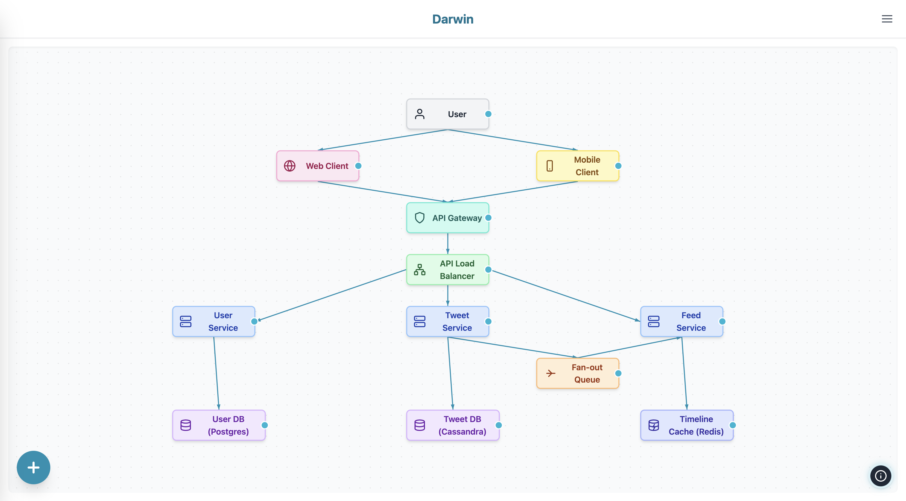
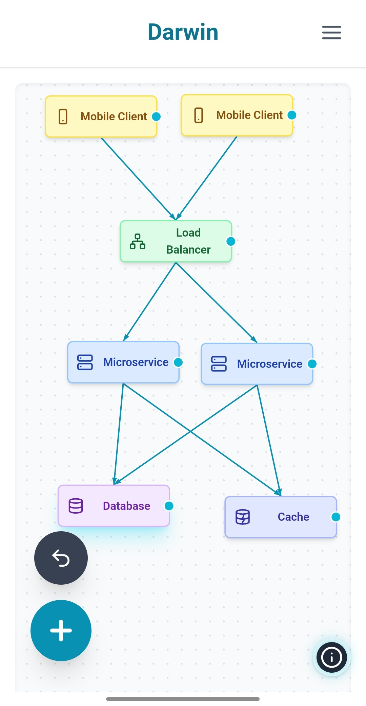
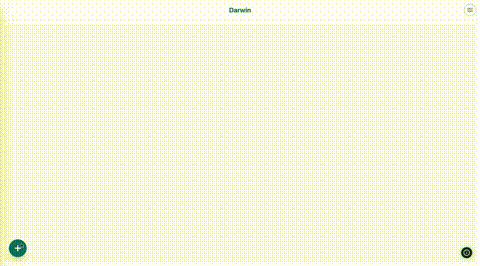

# Darwin: High-Level Design Diagram Builder

### Desktop View


### Mobile View


Darwin is an interactive web application for creating High-Level Design (HLD) diagrams. Effortlessly drag and drop components like load balancers, databases, microservices, and more onto a canvas, connect them visually, and export or import your designs. Darwin now includes specialized automotive components for designing vehicle system architectures, making it ideal for automotive engineers, software architects, and students working on modern vehicle systems.

## Darwin in action




## Features

- **Drag & Drop Canvas:** Add, move, resize, and connect components visually.
- **Predefined & Custom Elements:** Includes icons for users, web/mobile clients, gateways, databases, caches, queues, and more. Add your own custom elements as needed.
- **Automotive Components:** Specialized components for vehicle architectures:
  - **Containers:** MCU Container, Rich OS Container, Cloud Container, AWS Instance
  - **Vehicle Systems:** ECU, TCU, Gateway ECU, VCU, ADAS ECU, Infotainment System
  - **Sub-components:** Modules, Services, Application Layers, Operating System Layers
  - **Connectivity:** CAN Bus, Ethernet, LIN Bus connections with labeled arrows
- **Smart Connectors:** Draw arrows between components with customizable labels and colors; connectors adjust automatically as you move elements.
- **Container Support:** Components can be nested inside containers with proper parent-child relationships.
- **Expandable Components:** Application layers and OS layers can contain sub-components (modules/services).
- **Undo/Redo:** Full undo/redo support for all actions.
- **Multi-Select & Area Select:** Select multiple elements by holding space and dragging, or by clicking with modifiers.
- **Rename & Edit:** Double-click to rename any element.
- **Responsive UI:** Works beautifully on desktop and mobile devices.
- **Export/Import:** Export your diagram as PNG/JPEG image or JSON. Import diagrams from JSON files.
- **Example Architectures:** Load sample diagrams for e-commerce, social media, video streaming, and automotive systems.


## Getting Started

### Prerequisites
- [Node.js](https://nodejs.org/) (v18 or newer recommended)

### Installation

1. **Clone the repository:**
   ```bash
   git clone <your-repo-url>
   cd darwin
   ```
2. **Install dependencies:**
   ```bash
   npm install
   ```

### Running Locally

Start the development server:
```bash
npm run dev
```
Visit [http://localhost:5173](http://localhost:5173) in your browser.

### Building for Production

```bash
npm run build
```
The output will be in the `dist/` directory. You can preview the production build with:
```bash
npm run preview
```

## Usage Tips

- **Zoom:** Use mouse wheel or pinch on touch devices.
- **Pan:** Drag the canvas background.
- **Area Select:** Hold <kbd>Space</kbd> and drag to select multiple elements.
- **Multi-Select:** Hold <kbd>Space</kbd> and click elements.
- **Delete:** Select elements and press <kbd>Delete</kbd>.
- **Undo/Redo:** <kbd>Cmd/Ctrl + Z</kbd> and <kbd>Cmd/Ctrl + Y</kbd>.
- **Export:** Use the export menu to save as image or JSON.
- **Import:** Use the import menu to load a diagram from JSON.

### Working with Automotive Components

- **Containers:** Drag MCU Container, Rich OS Container, or Cloud Container from the drawer. Drop other components inside to create hierarchical architectures.
- **Vehicle Components:** Add ECUs, TCUs, Gateways, and other vehicle systems. Connect them using CAN Bus, Ethernet, or LIN Bus connections.
- **Sub-components:** Drop Modules or Services into Application Layers or OS Layers to create detailed software architectures.
- **Connection Labels:** After connecting components, click on the arrow to add labels like "CAN Bus", "Ethernet", etc.
- **Container Fitting:** Components automatically arrange within containers. The container rendering has been optimized to properly display nested components.

## Example Diagrams

Find example architectures in the `examples/` and `public/examples/` folders:
- E-commerce Platform
- Social Media System
- Video Streaming Service
- **Automotive Systems:**
  - ADAS System Architecture
  - Cloud-Connected Vehicle
  - MCU Architecture Design
  - Rich OS Application Layers
  - Vehicle Network Topology

You can load these from the app's example menu.

## Project Structure

- `components/` – React components for the UI and canvas
- `hooks/` – Custom React hooks (e.g., undo/redo, media queries)
- `examples/` – Example diagram JSONs
- `public/` – Static assets and public example diagrams
- `types.ts` – TypeScript types for elements, connectors, diagrams
- `constants.tsx` – Default element configs and dimensions
- `App.tsx` – Main application logic
- `index.tsx` – Entry point

## Tech Stack
- [React 19](https://react.dev/)
- [Vite](https://vitejs.dev/)
- [Tailwind CSS](https://tailwindcss.com/) (via CDN)
- TypeScript


## Contributing

We welcome contributions and feedback!
If you find a bug, have a feature request, or want to improve Darwin, please [open an issue](https://github.com/sroy8091/darwin/issues) or submit a pull request.

- Check the existing issues before creating a new one.
- For major changes, please open an issue first to discuss what you would like to change.
- See the `CONTRIBUTING.md` file for guidelines (if available).

Your ideas, bug reports, and code are all appreciated—let’s make Darwin better together!

## License

MIT License. See [LICENSE](LICENSE) for details.

---

*Made with ❤️ for system designers and architects.*
